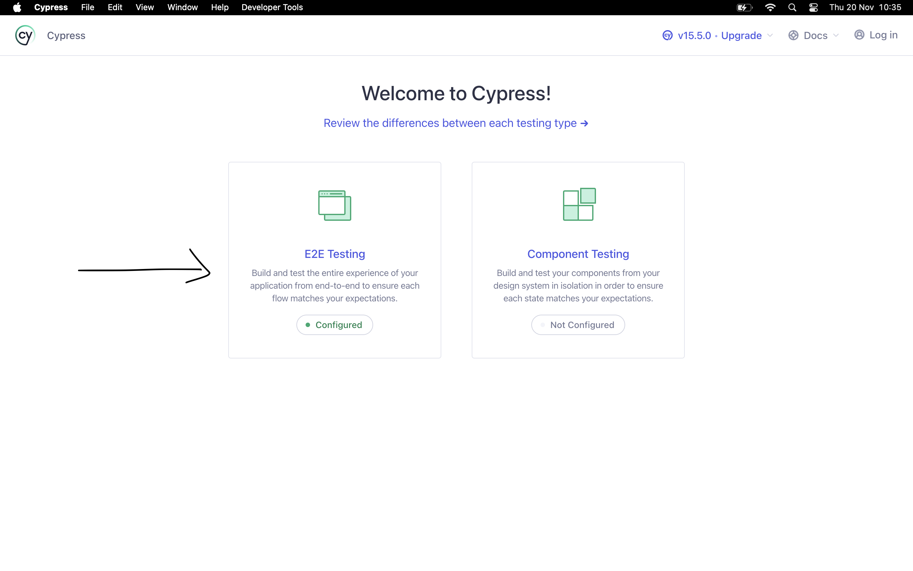
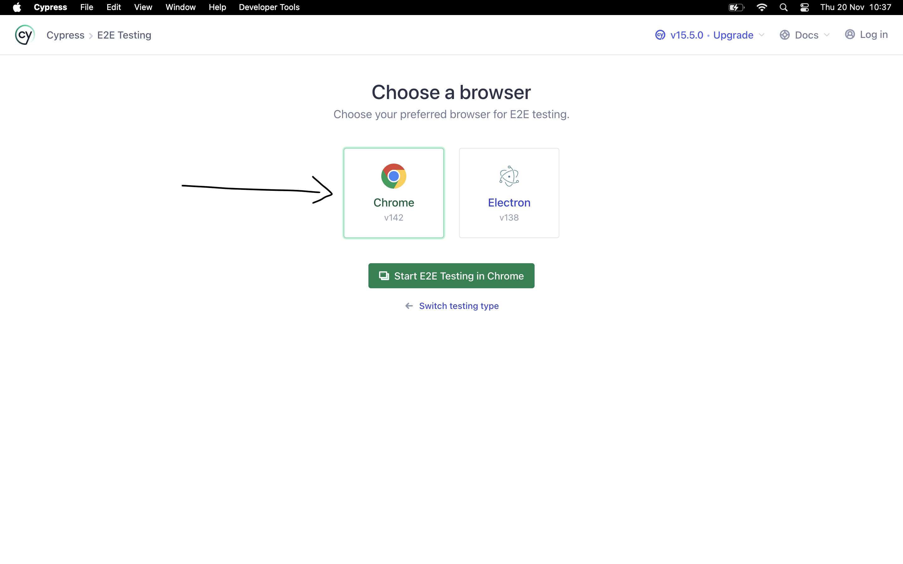
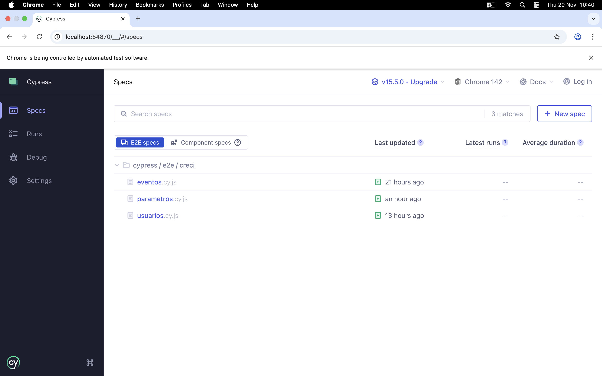

# Automation Test HGTX

Projeto de automação de testes **E2E (End-to-End)** desenvolvido com
**Cypress** para validação de funcionalidades da plataforma <a href="https://creci-hgtxcore.goutron.com.br/login/login">**HGTX**</a>.

## 🚀 Pré-requisitos

Antes de começar, certifique-se de ter instalado em sua máquina:

- **Node.js** (versão 20.x ou superior)
- **npm** (geralmente já incluso ao instalar o Node.js)
- **VSCode** ou qualquer IDE de desenvolvimento

Verifique se possui o Node.js instalado, execute esse comando no terminal:

```bash
node --version
npm --version
```

## 📦 Instalação

1.  Instale as dependências:

```bash
npm install
```

## 🔑 Acesso

1.  Crie um arquivo **.env** na raiz do projeto como no exemplo do **.env.example**, e insira as credenciais de acesso a plataforma <a href="https://creci-hgtxcore.goutron.com.br/login/login">**HGTX**</a>.

```bash
API_USER=usuario@gmail.com
API_PASS=123456
```

## ▶️ Como Executar

### Modo Interativo (Cypress Test Runner)

Para abrir a interface interativa do Cypress,execute o comando no terminal:

```bash
npm run cypress:open
```

Clique sobre a opão E2E Testing:



Clique sobre a opão Chrome e **Start E2E Testing in Chrome**:



Será possível ver essa tela:



Pronto! Agora é só executar os testes clicando sobre eles.
